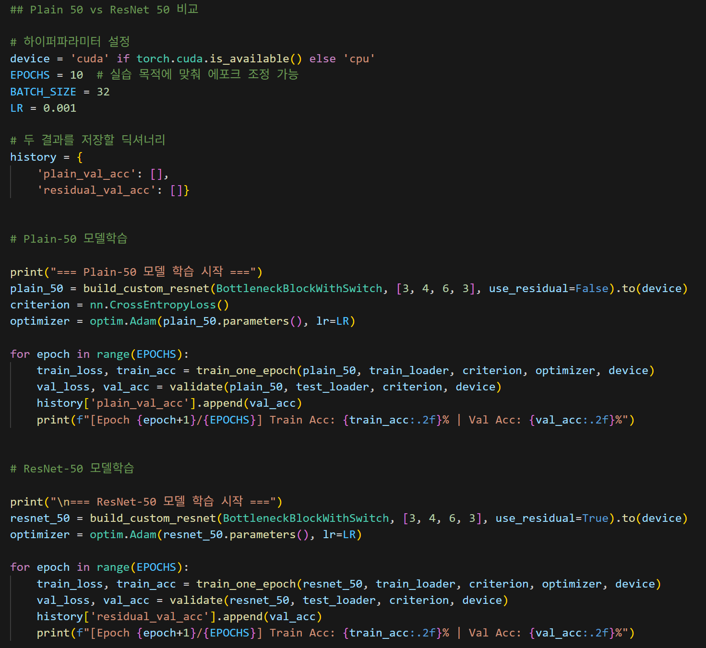
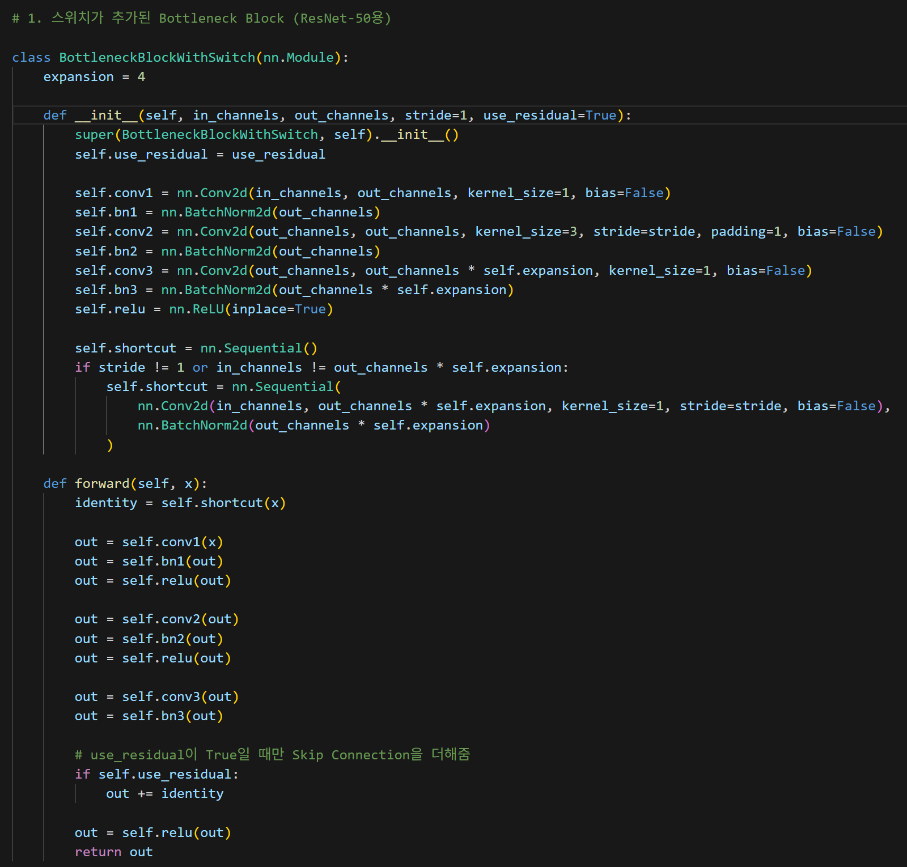

# AIFFEL Campus Online Code Peer Review Templete
- 코더 : 강성진
- 리뷰어 : 김택훈


# PRT(Peer Review Template)
- [△]  **1. 주어진 문제를 해결하는 완성된 코드가 제출되었나요?**
    - 문제에서 요구하는 최종 결과물이 첨부되었는지 확인
        - 중요! 해당 조건을 만족하는 부분을 캡쳐해 근거로 첨부
        ResNet-34에 대한 결과 비교가 없음 
        - 
    
- [x]  **2. 전체 코드에서 가장 핵심적이거나 가장 복잡하고 이해하기 어려운 부분에 작성된 
주석 또는 doc string을 보고 해당 코드가 잘 이해되었나요?**
    - 해당 코드 블럭을 왜 핵심적이라고 생각하는지 확인
    - 해당 코드 블럭에 doc string/annotation이 달려 있는지 확인
    - 해당 코드의 기능, 존재 이유, 작동 원리 등을 기술했는지 확인
    - 주석을 보고 코드 이해가 잘 되었는지 확인
        - 중요! 잘 작성되었다고 생각되는 부분을 캡쳐해 근거로 첨부
        residual block을 switch 구조로 효율적으로 구현함 
        
- [x]  **3. 에러가 난 부분을 디버깅하여 문제를 해결한 기록을 남겼거나
새로운 시도 또는 추가 실험을 수행해봤나요?**
    - 문제 원인 및 해결 과정을 잘 기록하였는지 확인
    - 프로젝트 평가 기준에 더해 추가적으로 수행한 나만의 시도, 
    실험이 기록되어 있는지 확인
        - 중요! 잘 작성되었다고 생각되는 부분을 캡쳐해 근거로 첨부
        - 에러는 아니지만 학습의 한계에 봉착한 모델을 pretrained로 대체하여 높은 정확도를 달성한 것이 인상깊었음 
        
- [x]  **4. 회고를 잘 작성했나요?**
    - 주어진 문제를 해결하는 완성된 코드 내지 프로젝트 결과물에 대해
    배운점과 아쉬운점, 느낀점 등이 기록되어 있는지 확인
    - 전체 코드 실행 플로우를 그래프로 그려서 이해를 돕고 있는지 확인
        - 중요! 잘 작성되었다고 생각되는 부분을 캡쳐해 근거로 첨부
        시간상 따로 작성하지는 못하셨지만 서로의 코드에 대해 대화를 나누면서 차이점을 위주로 감상을 공유하였음 
        
- [x]  **5. 코드가 간결하고 효율적인가요?**
    - 파이썬 스타일 가이드 (PEP8) 를 준수하였는지 확인
    - 코드 중복을 최소화하고 범용적으로 사용할 수 있도록 함수화/모듈화했는지 확인
        - 중요! 잘 작성되었다고 생각되는 부분을 캡쳐해 근거로 첨부
    일단 읽기는 쉬워 간결하다고 볼수 있을것같다. 다만 GPT Said : 

    `
    중요한 실험상 개선점:
        현재 Oxford Pet의 공식 test split을 매 epoch 평가에 사용하고 있습니다. 엄밀하게는 trainval을 다시 train/validation으로 나누고, test set은 최종 평가에 한 번만 사용하는 것이 좋습니다. 또한 random seed 없이 각각 모델을 초기화하고 데이터 증강도 무작위로 적용했기 때문에, 결과 차이에는 residual connection 외의 우연성도 포함될 수 있습니다.
    ` 

# 회고(참고 링크 및 코드 개선)
```
# 리뷰어의 회고를 작성합니다.
# 코드 리뷰 시 참고한 링크가 있다면 링크와 간략한 설명을 첨부합니다.
# 코드 리뷰를 통해 개선한 코드가 있다면 코드와 간략한 설명을 첨부합니다.
```
서로 프로젝트를 진행한 과정에 대해 이야기를 나누면서 되게 비슷한 부분에서 어려움을 같이 겪었다는 것을 공유하며 그래도 사람 사는게 비슷하구나 싶었기도 하고, ResNet의 정확도가 낮고 학습을 추가로 진행하여도 오르지 않는 현상에 대해 gpt에게 물어보고 데이터 부족과 scratch의 한계를 답으로 얻었으나 그냥 데이터가 부족하다고 결론내고 치워뒀는데 동료는 후자에 대한 해결방안인 pretrained 모델으로 높은 정확도를 달성해낸걸 보고 새삼 나의 나태함을 반성하게도 되었다.  
EOF`
